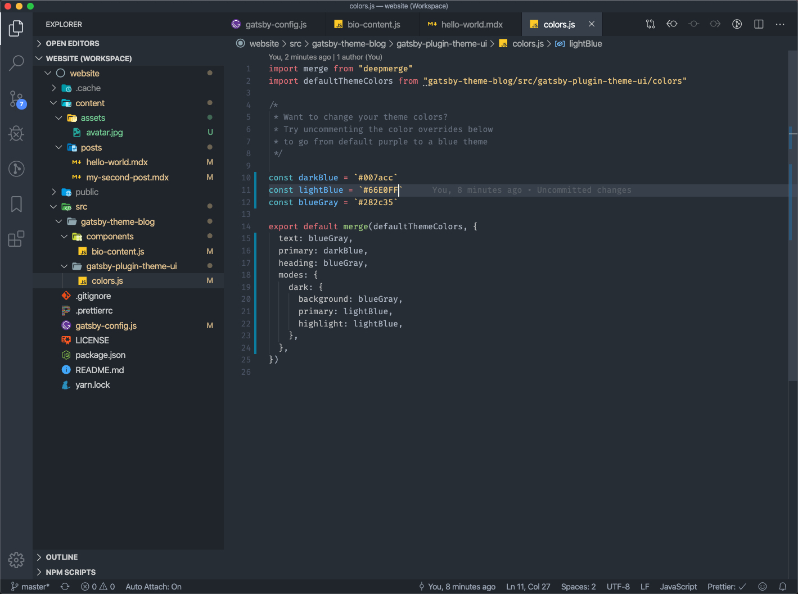

Gatsby is a free and open source framework for generating static sites with React. The main advantages of static sites are faster page loads and better ranks on search engines. Your website will be compiled in plain HTML pages including all local data in the bundle that will be served to your visitors. This means that no database access is necessary to serve your content, although you can still integrate with a backend to serve dynamic content.

## Where to learn Gatsby?

The best places to learn Gatsby are the [official tutorials](https://www.gatsbyjs.org/tutorial/), the [official documentation](https://www.gatsbyjs.org/docs/), and [egghead lessons](https://egghead.io/). The official resources are rich in details and will help you getting started with Gatsby as well as dive deep into it. The egghead lessons are really handy and powerful because they can teach you new skills as quickly as possible.

## Bootstrapping with a Gatsby starter

If you want to learn how to setup Gatsby from scratch and configure every detail yourself, this tutorial is not for you.

In this case, please check the [official tutorials](https://www.gatsbyjs.org/tutorial/) in the Gatsby's site.

Keep reading if you want a quick and simple way of starting a Gatsby blog with minimal configuration.

## Seamless experience with Gatsby themes

This approach is perfect if you want to skip dealing with configuration steps and just want to start blogging as quickly as possible. Be warned that this step offers little customisation support, but you can always migrate later to a more customised Gatsby setup while preserving your content.

In this case, skip Gatsby's Quick Start and go straight to [Getting Started with Gatsby Themes](https://www.gatsbyjs.org/docs/themes/getting-started/). Run the command line below to create your blog - replace `my-blog` or your name of the folder you want to store your blog.

```
npx gatsby new my-blog https://github.com/gatsbyjs/gatsby-starter-blog-theme
```

Wait until the command finishes executing. Your folder structure should look similar to this:



Now let's modify the following files:

### Blog configuration

Edit the file `gatsby-config.js` and modify the details inside the `siteMetadata` section. Replace the following fields for:

- `title` => name of your blog
- `author` => your publishing name, it can be either your real name or your pseudonym of choice
- `description` => descripton of your blog to be used for basic search engine optimisation
- `social` => put the url to your social networks, feel free to remove any existing entries or add more

### Your personal bio

Edit the file `src/gatsby-theme-blog/components/bio-content.js` and write your bio inside the `<Fragment>` tag. This bio will be displayed at the top of your start page, and at the bottom of your blog pages.

### Your avatar

Remove the file `content/assets/avatar.png`. Put a picture that you'd like to use as your avatar in the blog inside the folder `content/assets/` - it must be called either `avatar.png` or `avatar.jpg`.

### Customise your theme's colours

By default, this theme has an accent colour purple. If you want to change it, edit the file `src/gatsby-theme-blog/gatsby-plugin-theme-ui/colors.js` and uncomment all the commented lines. Replace the colours at your liking.

If you want to customise more colours than are defined in the `colors.js` file, check out the defaults on the gatsby-plugin-theme-ui source code. Check out the origin file for the imported reference `defaultThemeColors` in the file `node_modules/gatsby-theme-blog/src/gatsby-plugin-theme-ui/colors`.

Also note that there is a field called `dark` with more colour definitions, meaning that this theme has built-in support for switching between light and dark themes!

### Start writing!

Delete the sample files from the folder `content/posts`.

Create a new file to start writing your first post. Let's say we call it `hello-gatsby.mdx` - the filename will be used as the slug in the blog post url, becoming /hello-gatsby.

Add the Markdown frontmatter to the beginning of your new post file to define the post title and date:

```
---
title: Hello, Gatsby!
date: 2020-05-03
---

I've been excited about Gatsby for a long time!
```

You can read more about the Markdown syntax [here](https://github.com/adam-p/markdown-here/wiki/Markdown-Cheatsheet).

### Going live

I recommend checking out [Netlify](https://www.netlify.com/) for hosting your blog. Once you connect your GitHub repository to it, it will automatically detect it as a Gatsby blog and deploy it with zero configuration. You can customise your Netlify subdomain and also add your own domain name with a SSL certificate, everything for free!

### What's next?

Eventually you may want to customize your blog's layout. The starter theme used in this post is intended to get the simplest possible headstart, and given this simplicity, the layout is not customisable. When you want to customise it to add more of your personality on your website, you will need to learn more about Gatsby to create your custom setup. But this setup is more than enough to allow you to write!

Now, let your imagination flow and start blogging!
